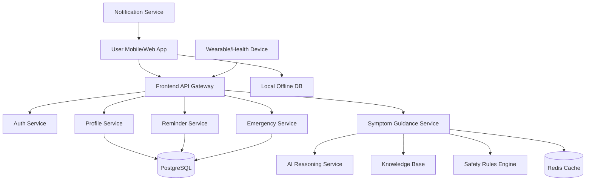

# AI Arogya Sathi - Full Architecture Plan

## 1. Product Goal
AI Arogya Sathi is an offline-first, multilingual health companion for Indian families. The product should help users:
- ask health questions in voice or text
- receive safe, understandable guidance
- track medicines and health trends
- manage family health profiles
- access emergency support even with weak or no connectivity

This architecture plan focuses on evolving the current exhibition prototype into a real, scalable product.

---

## 2. Architecture Overview
The system will be built as a layered architecture with four main layers:

1. Client Layer
   - Mobile app for end users
   - Web app for demo and admin use
   - Offline-first experience

2. Application Layer
   - User authentication and profile management
   - Symptom analysis and health guidance engine
   - Medicine reminder engine
   - Emergency assistance workflows
   - Notification and syncing services

3. Data Layer
   - User and family profile database
   - Health records and adherence data
   - Symptom knowledge base
   - Device and wearable integration data

4. AI and Intelligence Layer
   - Local AI/ML inference for offline capabilities
   - Cloud AI service for richer reasoning when online
   - Safety and confidence scoring for medical responses

---

## 3. High-Level Components

### 3.1 Frontend Clients
- Mobile app: React Native or Flutter
- Web app: React or Next.js
- Voice input: on-device speech recognition with fallback text input
- Local UI state: caching, offline service worker support, local database

### 3.2 Backend Services
- Authentication service
- User profile service
- Symptom and health guidance service
- Reminder service
- Emergency contact and support service
- Notification service

### 3.3 Data Stores
- PostgreSQL for structured relational data
- Redis for caching and session data
- Object storage for uploaded documents or media
- Local SQLite/IndexedDB for offline-first client storage

### 3.4 AI Services
- LLM-based reasoning service for health guidance
- Rules-based safety layer to reduce hallucinations
- Knowledge base retrieval layer for trusted information
- On-device fallback for low-connectivity operation

---

## 4. Functional Modules

### 4.1 Symptom Assistant
Responsibilities:
- accept voice/text symptom input
- detect language and intent
- provide guidance with confidence and caution
- escalate emergencies when needed

Flow:
1. User speaks or types symptom
2. Input is normalized and classified
3. System checks local rules and knowledge base
4. AI layer generates response with safety constraints
5. Response is shown with caution and next steps

### 4.2 Health Dashboard
Responsibilities:
- show vitals, trends, and health score
- present daily or weekly summaries
- support wearable/device sync

### 4.3 Family Profiles
Responsibilities:
- manage multiple users or family members
- store age, blood group, allergies, conditions, emergency number
- support profile switching in the app

### 4.4 Medicine Reminders
Responsibilities:
- track scheduled medicines
- show adherence trends
- send reminders and mark doses as taken

### 4.5 Emergency Support
Responsibilities:
- access emergency contacts quickly
- show nearby hospital or clinic information
- provide offline first-aid guidance
- support SOS behavior

---

## 5. System Architecture Diagram

---

## 6. Data Model

### 6.1 User
- id
- name
- phone
- language preference
- role
- created_at

### 6.2 Family Profile
- id
- user_id
- name
- age
- blood_group
- conditions
- allergies
- emergency_contact
- profile_photo_url

### 6.3 Health Record
- id
- profile_id
- heart_rate
- blood_pressure
- oxygen_level
- temperature
- sleep_hours
- timestamp

### 6.4 Medicine Record
- id
- profile_id
- medicine_name
- dosage
- schedule_time
- taken_at
- status

### 6.5 Symptom Query
- id
- profile_id
- input_text
- input_mode
- language
- created_at
- response_id

### 6.6 Response Log
- id
- query_id
- ai_output
- safety_score
- escalation_flag
- source

---

## 7. AI and Safety Layer
The AI system should never act like a medical authority without guardrails.

### 7.1 Design Principles
- provide general wellness information, not definitive diagnosis
- always include warning and escalation logic
- avoid overconfident medical claims
- mark emergency scenarios clearly

### 7.2 Safety Pipeline
1. Input understanding
2. Intent classification
3. Medical risk scoring
4. Evidence retrieval from trusted knowledge base
5. Safe response generation
6. Response formatting with caution banner

### 7.3 Fallback Strategy
- if online AI is unavailable, serve local rules and pre-approved content
- if connectivity is poor, show cached responses and offline emergency guidance

---

## 8. Offline-First Design
Because the product targets low-connectivity environments, offline support is essential.

### 8.1 Client Capabilities
- store profiles and reminders locally
- queue actions until reconnect
- use local speech recognition where possible
- show cached emergency content

### 8.2 Sync Strategy
- sync user profile changes when online
- sync health data in batches
- handle conflicts with last-write-wins or versioning

---

## 9. Security and Privacy
- encrypt sensitive health data at rest and in transit
- implement role-based access control
- require authentication for all personal data access
- log access and audit actions
- follow healthcare privacy expectations and local compliance rules

---

## 10. Technology Stack Recommendation

### Frontend
- React Native or Flutter for mobile
- React for web app
- Redux or Zustand for state management
- SQLite / IndexedDB for local persistence

### Backend
- Node.js with NestJS or Python with FastAPI
- REST or GraphQL APIs
- WebSocket support for live updates

### Database
- PostgreSQL
- Redis
- Object storage for media or documents

### AI / ML
- LLM API for response generation
- Retrieval-Augmented Generation (RAG) using verified medical content
- local rules engine for safety and offline mode

### DevOps
- Docker
- CI/CD pipeline
- cloud hosting or VPS deployment
- monitoring and logs

---

## 11. Development Phases

### Phase 1 - Foundation
- convert prototype into modular frontend architecture
- add backend API skeleton
- set up database schema
- implement authentication and profile management

### Phase 2 - Intelligence Layer
- integrate AI guidance service
- add knowledge base and response safety rules
- improve multilingual support

### Phase 3 - Real Health Data
- connect wearable/device data sources
- improve dashboard analytics
- build medicine adherence reports

### Phase 4 - Production Readiness
- add monitoring, security hardening, and compliance workflows
- optimize performance for low bandwidth environments
- expand offline behavior and reliability

---

## 12. Implementation Roadmap
1. Refactor current prototype into reusable frontend modules
2. Introduce a backend API layer
3. Create a database schema for users, profiles, and health records
4. Add authentication and secure storage
5. Build the AI reasoning and safety layer
6. Add notifications and reminder logic
7. Integrate wearable/device sync
8. Hardening for offline and low-connectivity environments

---

## 13. Risks and Mitigations
- Risk: medical advice could be unsafe
  - Mitigation: use safety rules, confidence thresholds, and human-review workflows

- Risk: poor offline reliability
  - Mitigation: local-first architecture and cached critical guidance

- Risk: data privacy concerns
  - Mitigation: encryption, role-based access, and secure storage design

- Risk: feature scope growth
  - Mitigation: phase the implementation and prioritize MVP features first

---

## 14. Recommended MVP Scope
The first real product version should include:
- user sign-in
- family profiles
- symptom assistant with voice/text input
- medicine reminders
- basic dashboard
- emergency support with offline mode

This MVP keeps the product useful while staying aligned with the PRD and the current prototype.
